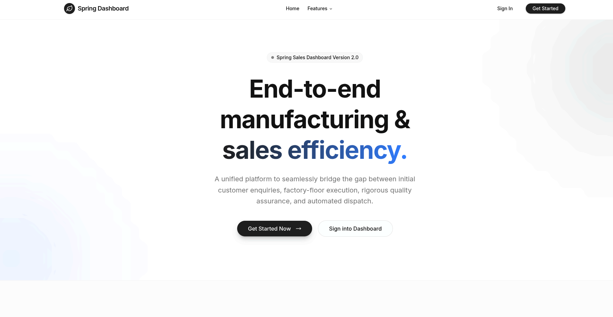
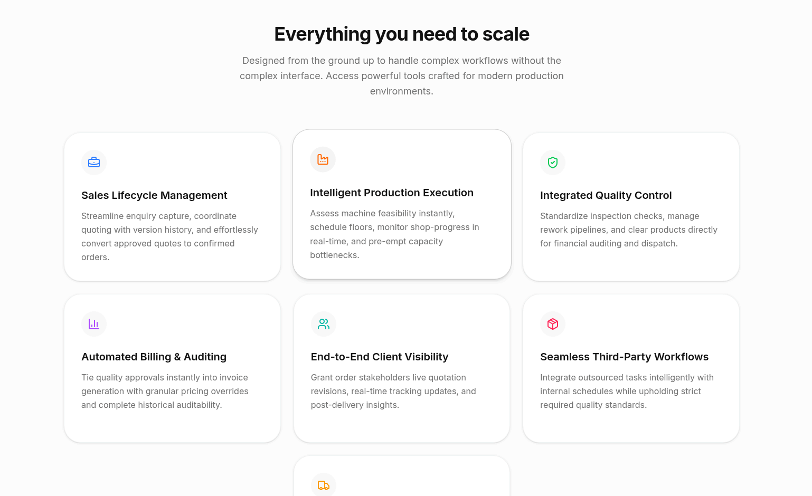
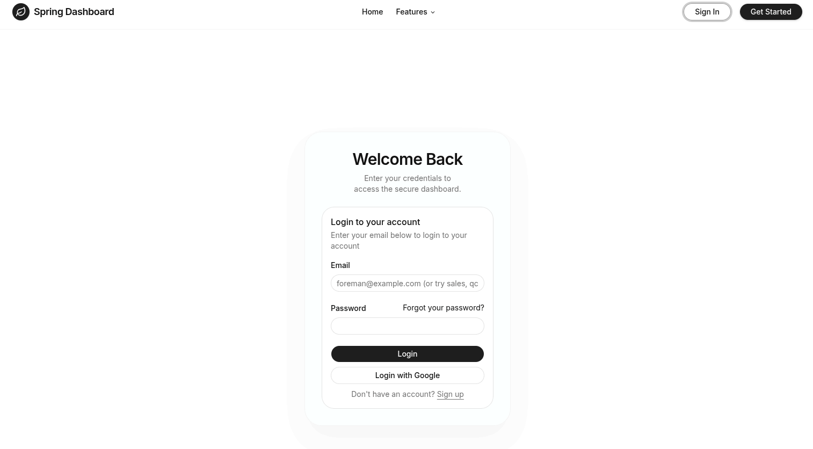
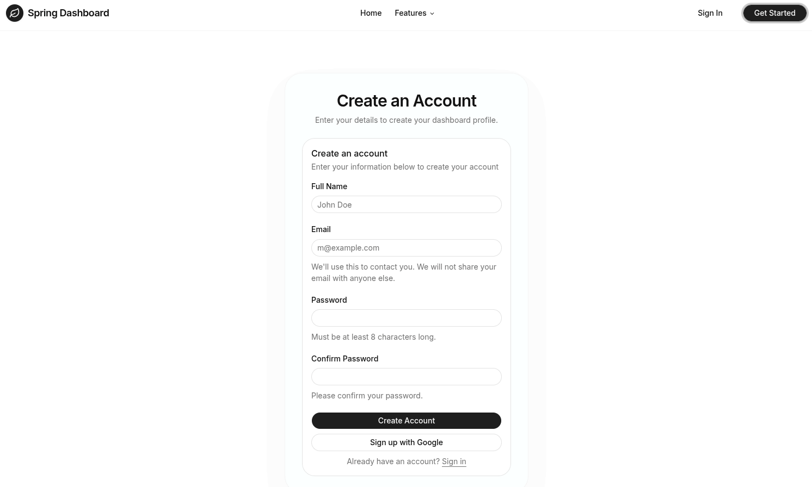
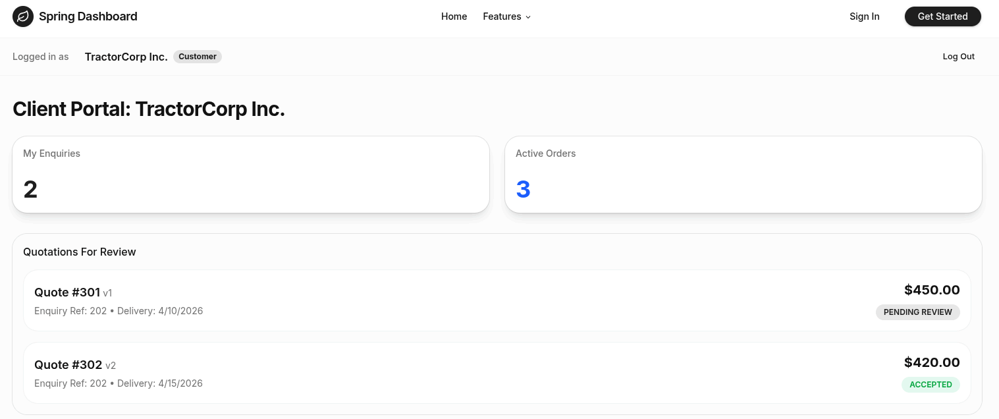
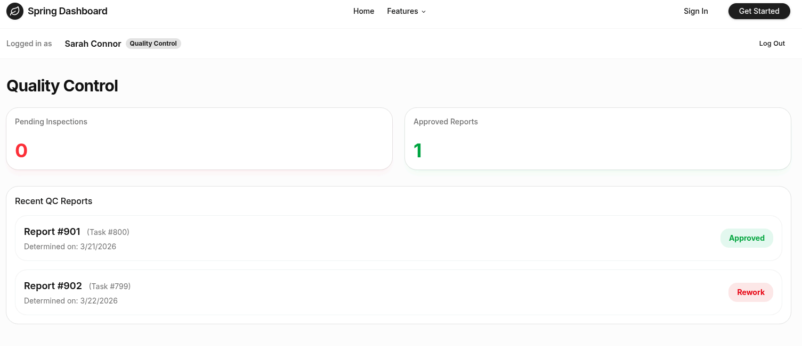
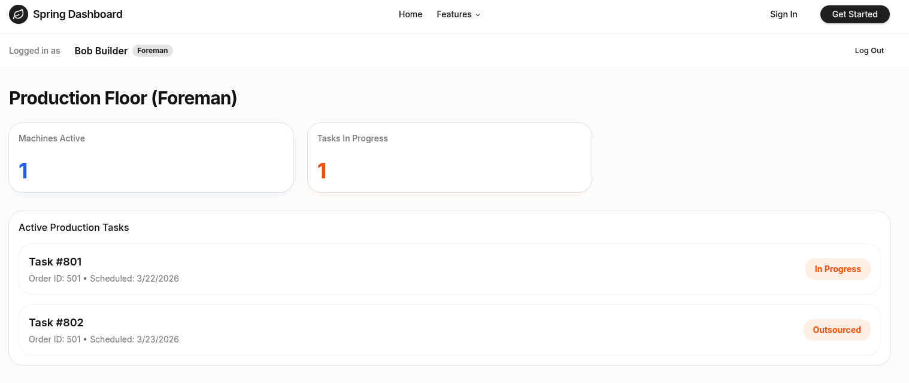
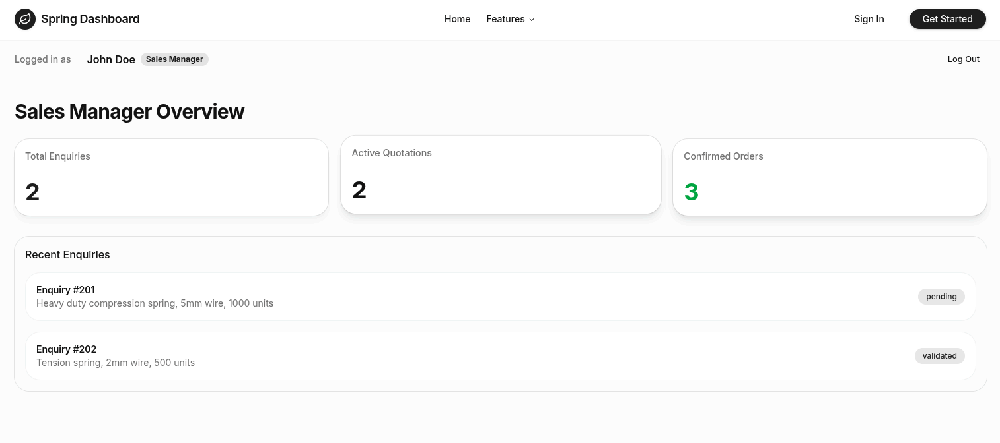

# Setup Project
```bash
git clone github.com/23f1002393/se-project-spring-dashboard.git
cd se-project-spring-dashboard/client && npm install
```
# Running Backend Server
```bash
cd server
pip install -r requirements.txt
python app.py 
```
# to populate with dummy data 
close app.py
```bash
python seed.py
python app.py
```
# Running Test Cases for APIs
```bash
pytest test_pytest.py -s -v
```
# Running Client Site
```bash
npm run dev
```

# Website Pages Screenshots
Use the login email below the corresponding images to login to different dashboards, with any password of minimum length 8, from the [Login Page](https://localhost:5173/login)


*Landing Page*


*Spring Dashboard Features*


*Login Page*


*Signup Page*


*Customer Dashboard - login (customer@example.com)*


*Vendor Dashboard - login (vendor@example.com)*


*Quality Control Dashboard - login (qc@example.com)*


*Logistics Dashboard - login (logistics@example.com)*


*Foreman Dashboard - login (foreman@example.com)*


*Sales Dashboard - login (sales@example.com)*
